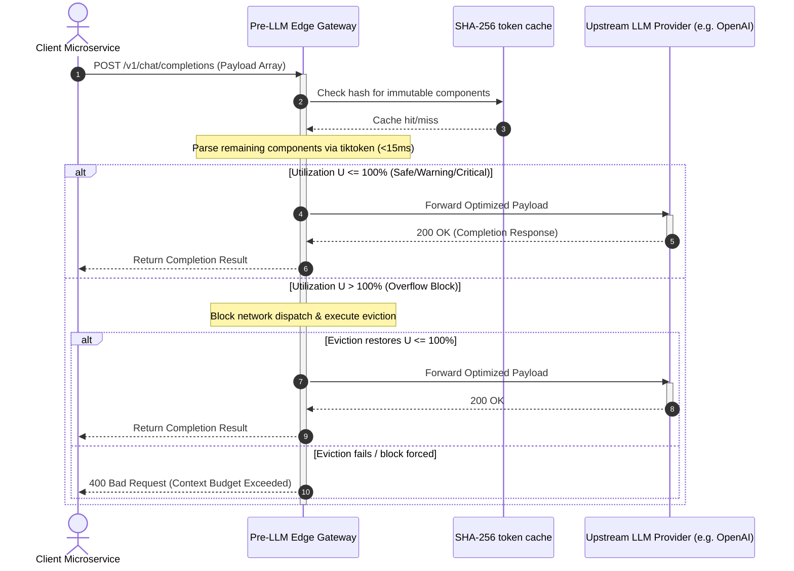
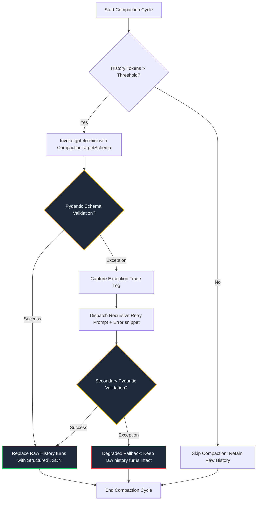
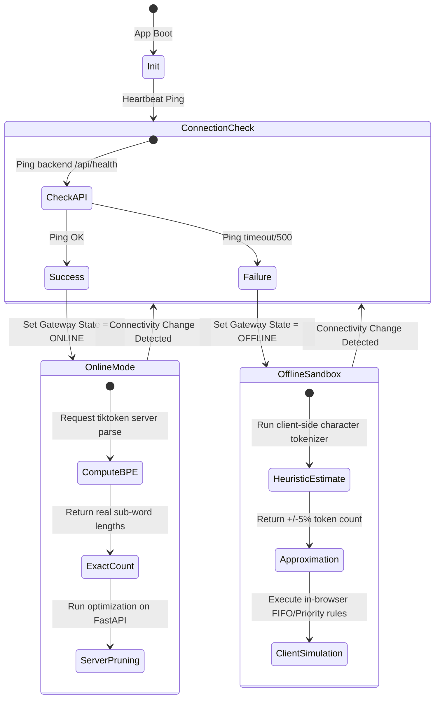
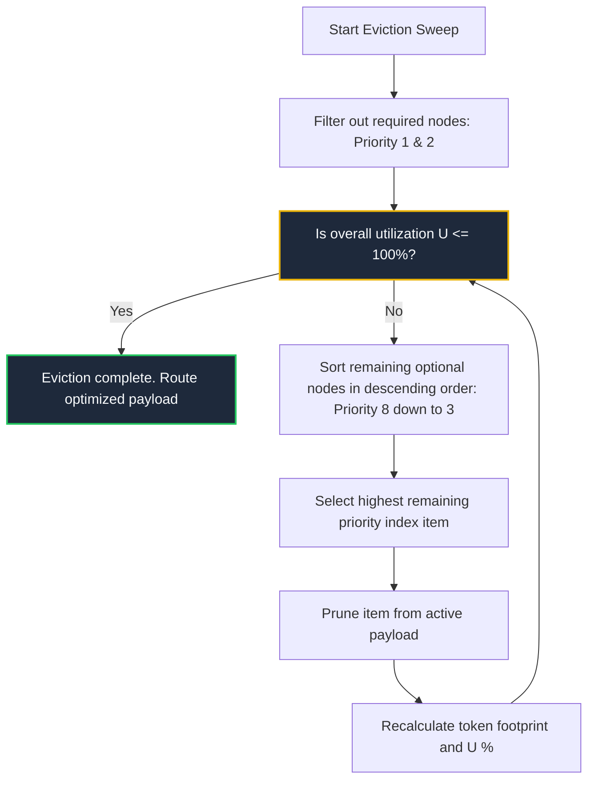

# 🏛️ Architecture Decision Records (ADRs)

This document serves as the formal **Architecture Decision Log (ADL)** for the Context Gateway. It captures the critical architectural choices made during the system's design phase, the engineering forces and constraints that drove them, the alternatives considered, and the resulting technical tradeoffs.

These records represent the operational standards and defensive design patterns of a **Principal Architect** in enterprise systems design.

---

## Index of Decisions
*   **[ADR-001: Pre-LLM Edge-Gateway Proxy Architecture](#adr-001-pre-llm-edge-gateway-proxy-architecture)**
*   **[ADR-002: Type-Safe History Compaction using OpenAI Structured Outputs](#adr-002-type-safe-history-compaction-using-openai-structured-outputs)**
*   **[ADR-003: High-Fidelity Client-Side Sandbox & Offline Resiliency Fallback](#adr-003-high-fidelity-client-side-sandbox--offline-resiliency-fallback)**
*   **[ADR-004: Priority-Based Context Eviction Hierarchy](#adr-004-priority-based-context-eviction-hierarchy)**

---

## ADR-001: Pre-LLM Edge-Gateway Proxy Architecture

### Status
`Accepted`

### Context
In high-scale enterprise AI environments, large language models (LLMs) treat input prompts and system instructions as raw byte-streams mapping to finite, high-cost context windows. Traditional microservice applications interact with LLM providers reactively. They either:
1.  Encounter unexpected **OutOfMemory (OOM) API errors** or **context limits** under heavy usage and execute blunt backoff retries.
2.  Maintain local, fragmented token counting inside isolated client SDK libraries (e.g., custom Python or Node.js wrappers) scattered across different development teams.

This reactive paradigm triggers systemic issues:
*   **High Network Latency & Waste:** Transporting massive prompts across the network only to have them rejected at the model provider boundary wastes resources and inflates API costs.
*   **Attentional Decay:** Bloated prompts scatter central context, causing "Lost-in-the-Middle" performance degradation.
*   **Lack of Unified Governance:** Security, cost controls, and latency budgets cannot be uniformly enforced across an enterprise when parsing logic is distributed.

### Decision
Implement a low-latency, centralized **Pre-LLM Edge Gateway Proxy** that intercepts, profiles, and optimizes all prompt payloads *before* they are serialized and transmitted to external model provider endpoints.

#### Alternatives Considered
*   **Option A: Decentralized Client SDK Integration (e.g., LangChain/LlamaIndex)**
    *   *Pros:* No additional network hop; easy for individual developers to plug in.
    *   *Cons:* Fragmented implementations. Highly difficult to audit or enforce uniform enterprise budget limits. Language-lock issues (e.g., keeping Python and TypeScript tokenizer libraries synchronized).
*   **Option B: Reactive Post-Request Retry Handlers**
    *   *Pros:* Simplest architecture; zero upfront processing costs.
    *   *Cons:* Unacceptable tail latency ($P_{99}$) spikes due to backoff delays; expensive outbound billing for rejected requests.
*   **Option C: Centralized Edge-Gateway Proxy (Selected)**
    *   *Pros:* Centralizes enterprise budgeting, provides visual diagnostics, enforces standardized priority gates, and implements uniform safety guards.
    *   *Cons:* Introduces an additional lightweight microservice boundary. Requires strict sub-15ms processing constraints.

### Consequences
*   **Positive:** Guaranteed security against OOM API crashes; centralized observability; standardized token accounting across all enterprise microservices.
*   **Negative:** Adds a network boundary. To mitigate latency inflation, the gateway must implement high-performance BPE token counters utilizing SHA-256 content caching.

---

## ADR-002: Type-Safe History Compaction using OpenAI Structured Outputs

### Status
`Accepted`

### Context
Multi-turn conversational systems quickly saturate context windows. While chronological truncation (FIFO) is fast, it permanently deletes historical context, rendering the model incapable of remembering long-term user requirements. 

Traditional approaches compress historical turns using free-form LLM summarization. However, in enterprise environments, this introduces significant engineering risks:
*   **Hallucination of Core Identifiers:** Unstructured summarizers often omit or alter critical parameters (e.g., tracking IDs, SKU numbers, customer names).
*   **Conversational Bloat:** Free-form summaries contain conversational filler (e.g., `"Here is a summary of the customer's request..."`), which wastes token budgets.
*   **Parsing Instability:** Downstream prompts cannot reliably map unstructured summaries to automated APIs or database lookups.

### Decision
Enforce a type-safe **Real Summarized Compaction Engine** utilizing OpenAI's Structured Outputs (`response_format` referencing a strict Pydantic JSON schema). 

The compaction must strictly serialize chat histories into four immutable properties:
1.  `summary`: A concise, objective summary of the user's primary intent.
2.  `retainedFacts`: An array of validated variables (SKUs, IDs, system codes).
3.  `openTasks`: A checklist of unresolved tasks requiring downstream execution.
4.  `droppedDetails`: An audit log of conversational fluff removed to save tokens.

Additionally, to prevent system failures under schema validation exceptions, the engine must execute a **Self-Healing Recursive Retry Loop** that captures syntax exceptions and dispatches exactly one targeted self-correction attempt before falling back gracefully to raw history preservation.

### Alternatives Considered
*   **Option A: Unstructured Free-Form Summarization**
    *   *Pros:* Fast execution, low model constraints.
    *   *Cons:* Unacceptable hallucination rate; high variable degradation; lack of programmatic consistency.
*   **Option B: Standard Regex/Parser post-processing**
    *   *Pros:* Cheap; no API cost.
    *   *Cons:* Extremely brittle; easily defeated by minor variations in natural language replies.
*   **Option C: Structured Outputs via Pydantic Schemas (Selected)**
    *   *Pros:* Enforces type-safety at the API level; eliminates conversational fluff; guarantees exact data capture of key variables.
    *   *Cons:* Requires strict JSON schema integration; increases upstream processing cost during summarization cycles.

### Consequences
*   **Positive:** Safe, programmatic memory condensation; up to 90% context footprint reduction; exact serialization of business variables.
*   **Negative:** Compaction cycles incur API costs and temporary latency. Managed by applying a configurable token threshold (e.g., only trigger compaction when history exceeds 3,000 tokens).

---

## ADR-003: High-Fidelity Client-Side Sandbox & Offline Resiliency Fallback

### Status
`Accepted`

### Context
A standard telemetry and diagnostic tool is highly dependent on its backend API infrastructure. However, in high-stakes enterprise settings—such as live presentations, client demos, or unexpected network outages—relying on a live server API to handle standard dashboard rendering introduces a major point of vulnerability. 

If the backend server is offline or the commercial LLM API is temporarily down, a traditional client app crashes or becomes completely unresponsive, ruining the presentation and blocking sandboxed developer testing.

### Decision
Architect a dual-mode **High-Fidelity Client-Side Sandbox Fallback** built directly into the client-side state store (Zustand). 

If the frontend detects a network failure or a backend offline state:
1.  Automatically switch the telemetry engine into **Simulated Offline Mode**.
2.  Execute token counting locally using a client-side sub-word heuristic approximation (character-based parsing).
3.  Simulate all pruning, FIFO truncation, and priority eviction algorithms entirely in the browser memory using TypeScript logic.
4.  Expose clear visual indicators notifying the operator that the application is running in an offline sandbox.

### Alternatives Considered
*   **Option A: Basic Connection Error Screens**
    *   *Pros:* Easiest to implement.
    *   *Cons:* Poor user experience; makes live demonstrations highly vulnerable to local Wi-Fi fluctuations.
*   **Option B: Client-side WebAssembly (WASM) Tiktoken Compiles**
    *   *Pros:* 100% exact local token counts.
    *   *Cons:* Drastically increases frontend bundle sizes; adds initial load delays; creates compatibility issues on mobile browsers.
*   **Option C: Heuristic Client-Side Simulation (Selected)**
    *   *Pros:* Zero overhead; instant response; guarantees 100% application uptime; maintains interactive sliding windows and priority drops without a backend.
    *   *Cons:* Token estimates are approximations (+/- 5% accuracy) rather than BPE-exact counts.

### Consequences
*   **Positive:** Absolute demo resilience; instant responsive visual feedback; frictionless developer testing without API key setup.
*   **Negative:** Slight variation between browser token approximations and actual API BPE counts. Resolved by displaying a clear "Offline Simulation Mode" banner to the user.

---

## ADR-004: Priority-Based Context Eviction Hierarchy

### Status
`Accepted`

### Context
Standard context eviction algorithms operate purely on chronological metadata. They treat prompts as raw strings and delete historical blocks from the head of the payload (FIFO) or slice content based on strict turn counters (Sliding Window).

However, corporate LLM prompts are complex, multi-part payloads containing mixed-context types: immutable system rules, safety guardrails, real-time vector database search documents, transactional user requests, and chat histories. 

Under chronological eviction (FIFO), high-value structural components (e.g., safety guardrails or API schemas) are dropped, while low-value chat history or outdated search results are retained. This breaks prompt semantics and can trigger system failures.

### Decision
Implement a structured **Priority-Based Context Eviction Hierarchy** that leverages a strict 1-to-8 priority matrix embedded directly into the prompt payload schema.

The gateway's optimization engine must sort all optional context segments in descending priority order (Priority 8 down to 3) and systematically evict low-value blocks first. **Pruning halts the exact millisecond the payload falls within safe utilization boundaries ($U \le 100\%$)**, protecting the remaining high-value context nodes.

### Alternatives Considered
*   **Option A: Chronological FIFO Truncation Only**
    *   *Pros:* Extremely simple to build.
    *   *Cons:* Destructive. Highly prone to evicting core system instructions or critical transaction data while preserving conversational noise.
*   **Option B: Uniform Sliding Window**
    *   *Pros:* Simple memory limits.
    *   *Cons:* Inelastic. Incapable of managing vector database components, tool outputs, or mixed payload architectures.
*   **Option C: Priority-Based Eviction (Selected)**
    *   *Pros:* Perfect preservation of prompt structures and safety guardrails under extreme load; optimal memory density allocation.
    *   *Cons:* Requires API developers to assign metadata priority values to all inbound payload segments.

### Consequences
*   **Positive:** Complete protection of system guardrails and critical operational contexts; highly intelligent context pruning; compatible with mixed payloads.
*   **Negative:** Adds minor metadata management overhead during prompt payload creation.
