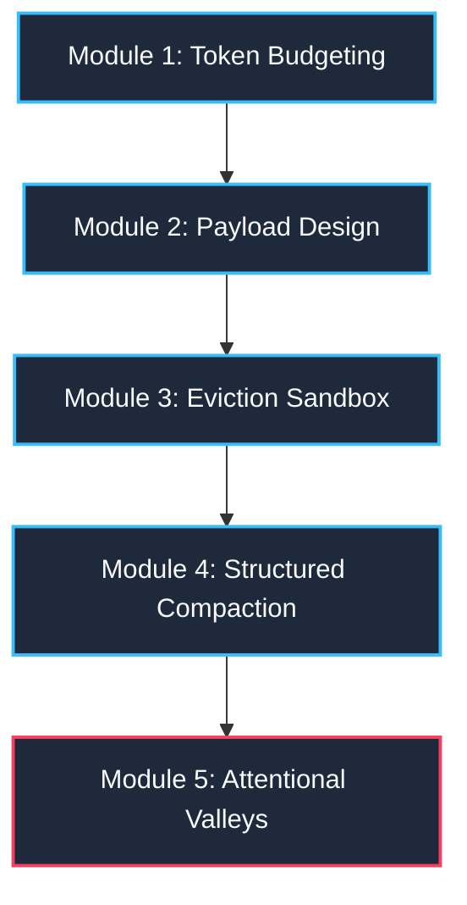

# 📖 Master Playbook & Runbook: Context Window Engineering

This playbook serves as a comprehensive master reference and runbook for context window engineering in enterprise GenAI gateways. It outlines high-fidelity diagnostic workflows, mathematical constraints, and advanced compaction strategies.

---

## 🏗️ Core Architectural Concepts & Interactive Validation Workflows
*Use these architectural concepts and diagnostic steps to validate the gateway's performance and optimization patterns.*

### 🧱 SECTION 1: Tokenization Mechanics (Sub-word Subsystem)
*   **The Concept**: Large language models process text in sub-word fragments called **tokens** rather than raw character strings or whole words. E.g., the word `"context"` is parsed into discrete token IDs (typically representing `["con", "text"]` in standard BPE vocabularies).
*   **Engineering Validation**: Type custom prompts (e.g., `"Ingestion gateway test payload"`) into the Active Input text area on the dashboard and observe the real-time tiktoken sub-word counter updates.

---

### 🪣 SECTION 2: Dynamic Shared Memory (Shared Input/Output Buffers)
*   **The Concept**: Prompt ingestion space (input) and completion space (output generation) share a singular, finite model context window buffer. Allocating excessive input tokens directly starves the completion buffer, leading to abrupt truncation errors or API out-of-memory (OOM) faults.
*   **Engineering Validation**: Modify the **Reserved Output** slider on the configuration panel. Observe how increasing the output reserve mathematically reduces the safe available input budget ($A_{\text{input}}$).

---

### 🃏 SECTION 3: Attentional Valley Mitigation (Lost-in-the-Middle Phenomenon)
*   **The Concept**: Transformer-based models exhibit a U-curve attentional response, demonstrating near-perfect retrieval of facts located at the absolute boundaries (primacy and recency) of long prompts, but suffering severe accuracy drops when critical data is buried in the geometric center of the context payload.
*   **Engineering Validation**: 
    1. Load the **`Lost-in-the-Middle Demo (Trap 5)`** stress preset to place the activation code in the exact center of a bloated token array.
    2. Execute **`FIFO Truncation`** or **`OpenAI Compaction`**.
    3. Observe how the optimization engine strips out context noise, bringing the activation passcode out of the attentional valley and closer to the active recency window.

---

### 🧽 SECTION 4: Edge Middleware Optimization (Pruning & Compaction Subsystems)
*   **The Concept**: High-performance gateways employ automated, granular eviction heuristics to safely scale down context footprints under load:
    *   **FIFO (First-In, First-Out) Truncation**: Evicts the oldest history turns chronologically.
    *   **Sliding Window**: Restricts conversation scope to a rolling $N$-turn threshold.
    *   **Priority-Based Retention**: Prunes optional context segments based on metadata priority tags (Priority 8 RAG docs up to Priority 3 summaries), protecting required rules (Priority 1 system instructions).
    *   **Structured Compaction**: Replaces voluminous, raw multi-turn histories with structured JSON summaries.

---

### 📡 SECTION 5: High-Fidelity Client-Side Fallback (Offline Resiliency)
*   **The Concept**: Enterprise UI systems must tolerate transient backend network failures. The gateway dashboard incorporates a client-side state machine (Zustand) with heuristic character-based token count models and memory-pruning simulations that execute entirely in-browser when backend services are unreachable.
*   **Engineering Validation**: Switch the dashboard to simulated offline mode (or terminate the API backend). Verify that eviction sliders, priority drops, and memory stack visualizations execute instantly inside the browser memory.

---

## 🗺️ Engineering Path Overview



---

## 📚 Module 1: Token Budgeting & Capacity Management

### The Concept:
You cannot throw text blindly at an LLM context window. Input prompts and generated completions share the exact same structural memory buffer. E.g., if you saturate an $8,192$-token context window with $8,000$ tokens of input text, the model has only $192$ tokens left to generate its reply. If it needs to write a $300$-token email, it will trigger an **abrupt output truncation** or **OOM API crash**.

### Step-by-Step Validation:
1.  Navigate to the **Telemetry Profiler** tab in the Left Sidebar.
2.  Look at **Panel A: Runtime Configuration**. Select the **`Standard Context (8,192 tokens)`** preset.
3.  Note that the circular **`Utilization Dial`** shows your budget size is **`6,372 tokens`**, not 8,192!
4.  Why? Read your numerical cards below the dial:
    *   **Total Model Limit:** `8,192` tokens.
    *   **Reserved Output Tokens:** `1,000` tokens (headroom reserved for response generation).
    *   **Safety Margin Padding:** `820` tokens (10% defensive buffer protecting against local-vs-remote BPE token count discrepancies).
    *   **Safe Available Input Budget ($A_{\text{input}}$):**
        $$A_{\text{input}} = 8,192 - 1,000 - 820 = 6,372 \text{ tokens}$$
5.  *Exercise:* Drag the **`Reserved Output Budget`** slider up to `2,000` tokens. Note how the available input budget dynamically drops to `5,372` tokens, illustrating how output space directly chokes input capacity.

---

## 📚 Module 2: Multi-Part Ingestion Payload Design

### The Concept:
In enterprise GenAI, we do not compose prompts as single, flat strings. Instead, prompts are constructed as **Structured Context Arrays** where each item has:
*   A specific **Component Type** (`system`, `history`, `retrieved_document`, `tool_output`, `active_user_input`, `summary`).
*   A strategic **Priority Value** (Priority 1 is highest, Priority 8 is lowest).
*   A **`required` Boolean Flag** (required=true is protected from pruning).

### Step-by-Step Validation:
1.  Look at **Panel B: Payload Builder Canvas**. Toggle between the tabs:
    *   **`System Prompt`**: Core behavioral guidelines. E.g., "Act as a professional customer support agent." (Priority 1, required=true).
    *   **`Chat Turns`**: Active simulated conversation turns (Priority 7, required=false).
    *   **`Vector Docs`**: Simulated retrieved database information chunks (Priority 5 & 8, required=false).
    *   **`Tool Outputs`**: Raw API JSON dumps injected back into context (Priority 6, required=false).
    *   **`Active Input`**: Immediate question that needs an answer (Priority 2, required=true).
2.  Type custom sentences inside the **`Active Input`** text area.
3.  *Observation:* Your keystrokes trigger a **300ms debounce loop**! The frontend waits for 300ms of typing inactivity before sending the text to the backend `tiktoken` parser, protecting your APIs from excessive network requests.

---

## 📚 Module 3: Eviction Sandbox & Algorithmic Pruning

### The Concept:
When your payload is too large, the system risk state advances to **Warning (Yellow)**, **Critical (Neon Crimson)**, or **Overflow (Red)**. To restore the prompt to a safe threshold, the gateway executes modular eviction strategies:

*   **FIFO Truncation**: Deletes the oldest conversation turns chronologically.
*   **Sliding Window**: Enforces a rigid $N$-turn limit, pruning anything older.
*   **Priority-Based Retention**: Prunes low-value optional items first (Priority 8 RAG docs $\rightarrow$ Priority 7 old history $\rightarrow$ Priority 6 tool JSON), keeping high-value items intact.
*   **RAG Document Trim**: Selectively prunes lower-relevance document chunks.

### Step-by-Step Validation:
1.  Navigate to the **`Stress Presets`** sidebar menu.
2.  Click **`Load Stress Preset`** on **`RAG Payload Overflow (Trap 3)`**.
3.  Note that the dashboard immediately loads 15 dense retrieved document chunks. The telemetry dial surges to **`116%`** in a **`Hard Overflow`** state!
4.  Navigate to the **`Truncation Sandbox`** tab in the sidebar.
5.  Select **`RAG Doc Trim`** as your active strategy.
6.  Click **`Run Optimization Algorithm`**.
7.  *Observation:* Inspect the side-by-side comparison. The optimizer has pruned the 9 lowest-ranked documents (Priority 8) saving `2,200` tokens, while protecting the 6 high-ranked docs (Priority 5) and core system/user nodes, bringing the payload safely back to a **`Safe`** status!

---

## 📚 Module 4: OpenAI Structured Compaction & Self-Healing

### The Concept:
Standard text summarizers introduce hallucinations or loose conversational filler. In this application, we compress stale history turns into type-safe data nodes using **OpenAI Structured Outputs** (`response_format` referencing a strict Pydantic schema). 

The compactor splits history into:
1.  `summary`: An unsentimental distillation of user goals.
2.  `retainedFacts`: High-value parameters (SKUs, activation passcodes).
3.  `openTasks`: Pending unresolved user requests.
4.  `droppedDetails`: Irrelevant conversational fluff removed for budget control.

If schema parsing fails, a **Self-Healing Loop** dispatches exactly one retry containing the exception log. If it fails again, a **Degraded Fallback** preserves the raw history, preventing session data loss.

### Step-by-Step Validation:
1.  Navigate to the **`Stress Presets`** tab and load **`50-Turn Latency Drift (Trap 2)`**.
2.  Note how a long support chat has bloated your history tokens.
3.  Navigate to the **`Compaction Terminal`** tab in the sidebar.
4.  Review your history turns and click **`Execute Summarized Compaction`**.
5.  *Observation:* Inspect the returned Structured Compaction card! The raw history turns have been stripped. In their place is a single, clean **`Gateway State Memory Summary`** node displaying your compacted summary text, extracted durable facts, and open action lists, saving up to **`90%`** of context volume!

---

## 📚 Module 5: Positional Lost-in-the-Middle Valleys

### The Concept:
LLMs have an **attentional U-curve**: they excel at retrieving information located at the absolute beginning (primacy effect) or end (recency effect) of long context prompts, but struggle to retrieve details placed in the exact center.

```mermaid
xychart-beta
    title "Model Information Retrieval Accuracy vs. Positional Depth"
    x-axis [0% Primacy, 20%, 40%, 60% Attentional Valley, 80%, 100% Recency]
    y-axis "Accuracy %" 0 --> 100
    line [98, 75, 32, 28, 68, 97]
```

### Step-by-Step Validation:
1.  Navigate to **`Stress Presets`** and load **`Lost-in-the-Middle Demo (Trap 5)`**.
2.  Review your history. Note that standard chat filler spans thousands of tokens, but in the exact center ($50\%$ positional depth), we embedded a critical activation code: `VIP-RETAIL-2026`.
3.  If you send this flat prompt to standard models, they frequently fail to answer correctly because the key info is lost in the attentional valley.
4.  Apply **`FIFO Truncation`** or **`OpenAI Compaction`**.
5.  *Observation:* Note how compressing the payload collapses the positional depth of `VIP-RETAIL-2026`, moving it out of the saturated center and closer to the active recency window, immediately restoring LLM retrieval accuracy!

---

## 🛠️ Production Verification & Edge-Case Q&A
*Operational reference for addressing critical system edge cases:*

### Q1: "Why don't we just use a model with a 2-million context window and send everything?"
*   **Answer**: Three major reasons:
    1.  **Cost**: Large context is extremely expensive. Running millions of tokens on every message will exhaust your budget in minutes.
    2.  **Latency (TTFT)**: Processing a massive prompt takes significant compute time, raising Time-to-First-Token latency to several seconds, which ruins user experience.
    3.  **Accuracy (Lost-in-the-Middle)**: Even if a model can accept 2 million tokens, its recall is not uniform. Attentional decay causes the model to overlook critical facts buried in massive payloads.

### Q2: "Why do we need a 10% Safety Buffer on token counts?"
*   **Answer**: The gateway counts tokens locally using `tiktoken`. However, the remote LLM hosting API (e.g., OpenAI or Anthropic) might run a slightly different tokenizer, append hidden chat format tokens (like `<|im_start|>system\n`), or add metadata behind the scenes. The **10% Safety Buffer** ensures that if the local count is slightly off, the payload still will not overflow the remote model's API limit.

### Q3: "Is Structured Compaction better than generic summary-writing?"
*   **Answer**: Yes! A generic summary is unstructured text, so details like SKU numbers, customer IDs, and specific tasks can get lost or hallucinated. Structured Compaction uses strict JSON schemas to guarantee that variables like `retainedFacts` (e.g. system codes) and `openTasks` are extracted as exact programmatic data structures.

---

## 🧪 Diagnostic Verification Scenarios
*Perform these three diagnostic procedures to verify runtime optimization behavior:*

### 🏆 Scenario 1: Offline Sandbox & Local Emulation
*   **Objective**: Validate the gateway's client-side failover state and diagnostic resilience.
*   **Procedure**: 
    1. Interrupt backend API connectivity (or toggle Simulated Offline mode on the UI).
    2. Input unstructured payloads across active sections.
    3. Verify that the frontend state-machine executes sub-word estimations and sandbox pruning heuristics locally inside the browser.
*   **Architect's Note**: Enterprise integrations must achieve defensive resilience. Interactive telemetry and failover systems must gracefully degrade to local sandbox memory representations when remote model endpoints or API gateways are offline.

### 🏆 Scenario 2: Priority-Based Retention Verification
*   **Objective**: Confirm optimal preservation of core system guidelines and user objectives under high load.
*   **Procedure**:
    1. Load the **`Trap 3: RAG Payload Overflow`** preset.
    2. Set the optimization policy to **`Priority-Based Retention`** inside the sandbox.
    3. Run the optimization sequence.
    4. Confirm that lower-priority items (Priority 8 documents) were evicted, while the crucial behavioral guidelines (Priority 1 system prompt) remained untouched.
*   **Architect's Note**: Prompt payloads are heterogeneous structures. Using strict priority registers guarantees that critical behavioral properties remain intact during budget constraints.

### 🏆 Scenario 3: Structured Compaction Integrity Check
*   **Objective**: Validate state retention and schema conformity under deep context pruning.
*   **Procedure**:
    1. Inject a multi-turn history turn containing specific transaction data: `"Hi, I need assistance with Order #ABC-98765. It hasn't arrived yet."` followed by conversational noise.
    2. Click **`Execute Summarized Compaction`** to launch the structured API.
    3. Verify that the transaction code `#ABC-98765` is preserved exactly inside the `retainedFacts` schema array.
*   **Architect's Note**: Compaction must strip conversational noise while programmatically protecting key operational variables.
