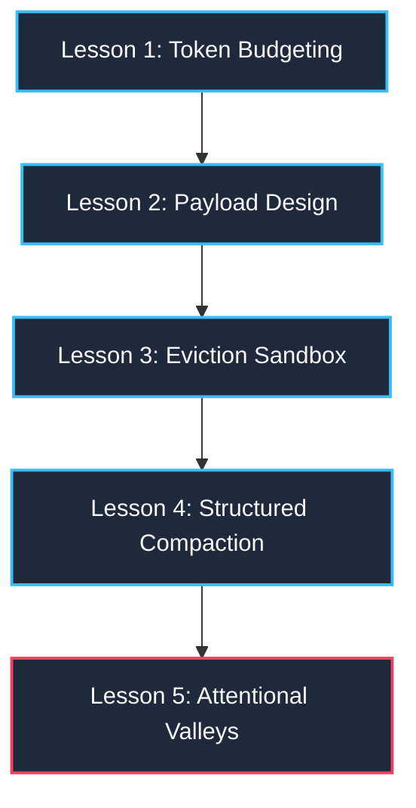

# 🎓 Step-by-Step Learning Guide: Context Window Engineering

This guide is structured as both an interactive student workshop manual and a step-by-step master curriculum for context window engineering. It is designed to be highly engaging, visual, and resilient for live presentations.

---

## 🎤 Student Workshop & Interactive Live Demos
*Use this slide-by-slide guide, simple analogies, and interactive games to present this project to an audience of students.*

### 🧱 SLIDE 1: What is a Token? (The Lego Analogy)
*   **The Analogy**: When you build a Lego castle, you don't use complete, pre-molded plastic walls. You snap together tiny, standard bricks. 
*   **The Concept**: AI models do not read raw English words. They read **tokens**—which are word pieces (sub-words). E.g., the word `"context"` is split into two token bricks: `["con", "text"]`.
*   **Classroom Action**: Show the students how the gateway tokenizer counts their text in real-time. Type `"Lego castle"` into the Active Input box and see how many "token bricks" are computed.

---

### 🪣 SLIDE 2: The Finite Bucket (Why Context Limits Matter)
*   **The Analogy**: Imagine your AI is a student taking a test, but they have a desk (the context window) that can only hold 8 sheets of paper. If they put 7 sheets of reference textbook pages on the desk, they only have 1 sheet left to write their exam answers.
*   **The Concept**: Input prompts and output answers compete for the same model capacity. If your prompt is too long, the AI will crash or cut off mid-sentence.
*   **Classroom Action**: Drag the **Reserved Output** slider up and down on the dashboard. Show the students how increasing the size of their answer (output space) directly shrinks the desk size available for their textbook notes (input budget).

---

### 🃏 SLIDE 3: Interactive Classroom Game: Find the Card! (Lost-in-the-Middle)
*   *Run this interactive magic trick to capture the room's attention:*
*   **The Game**: Show the students a wall of text containing 5,000 words. Place a single secret code (`VIP-RETAIL-2026`) in the exact geometric center. Ask the students to find it in 3 seconds. They will fail, proving how hard it is to locate information buried in noise.
*   **The Concept**: AI models suffer from the same attention valley. They retrieve details at the very beginning or end of prompts perfectly, but "forget" details placed in the center.
*   **Classroom Action**: 
    1. Load **`Trap 5: Lost-in-the-Middle`** from the presets. Show how the secret code is buried in the center.
    2. Run **`FIFO Truncation`** or **`OpenAI Compaction`**. 
    3. Show how the optimizer sweeps away the noise, moving the secret passcode out of the center valley and placing it right in front of the AI's active focus window!

---

### 🧽 SLIDE 4: The Ingestion Gateway (The Heroes of Prompt Engineering)
*   **The Analogy**: The gateway acts as a bouncer at the club door. If the club is full (Overflow), the bouncer stops the crowd (local block) and asks them to split into smaller groups or condense their invite list.
*   **The Concepts**:
    *   **FIFO (First-In, First-Out)**: The bouncer makes the oldest guests leave first to make room for new ones.
    *   **Sliding Window**: The bouncer only keeps the last $N$ people who arrived.
    *   **Priority Matrix**: The bouncer lets VIPs (System Prompt and active queries) in for free, while systematic dropping is applied to low-rank guests.
    *   **Structured Compaction**: Replaces 10 verbose pages of past chat history with a single index card summarizing facts and unresolved tasks.

---

### 📡 SLIDE 5: Classroom Wi-Fi Down? (Offline Resilience Mode)
*   **The Analogy**: Imagine going to give a presentation and the school Wi-Fi goes down! A standard web app would crash, showing an ugly red connection error.
*   **The Concept**: **High-Fidelity Offline Sandbox Mode**. The gateway store contains a fully local fallback. If it detects the backend server is offline, it estimates tokens using client-side sub-word counts and runs pruning logic directly in the browser!
*   **Classroom Action**: Disconnect your local server or toggle the offline simulate switch. Demonstrate that the eviction slider, priority drops, and memory visualization still work flawlessly inside the browser without a backend.

---

## 🗺️ Learning Path Overview



---

## 📚 Lesson 1: Token Budgeting & Available Budgets

### The Concept:
You cannot throw text blindly at an LLM context window. Input prompts and generated completions share the exact same structural memory buffer. E.g., if you saturate an $8,192$-token context window with $8,000$ tokens of input text, the model has only $192$ tokens left to generate its reply. If it needs to write a $300$-token email, it will trigger an **abrupt output truncation** or **OOM API crash**.

### Step-by-Step Action in the Dashboard:
1.  Navigate to the **Telemetry Profiler** tab in the Left Sidebar.
2.  Look at **Panel A: Runtime Configuration**. Select the **`Standard Context (8,192 tokens)`** preset.
3.  Note that the circular **`Utilization Dial`** shows your budget size is **`6,372 tokens`**, not 8,192!
4.  Why? Read your numerical cards below the dial:
    *   **Total Model Limit:** `8,192` tokens.
    *   **Reserved Output Tokens:** `1,000` tokens (headroom reserved for response generation).
    *   **Safety Margin Padding:** `820` tokens (10% defensive buffer protecting against local-vs-remote BPE token count discrepancies).
    *   **Safe Available Input Budget ($A_{\text{input}}$):**
        $$A_{\text{input}} = 8,192 - 1,000 - 820 = 6,372 \text{ tokens}$$
5.  *Exercise:* Drag the **`Reserved Output Budget`** slider up to `2,000` tokens. Note how the available input budget dynamically drops to `5,372` tokens, illustrating how output space directly chokes input capacity.

---

## 📚 Lesson 2: Multi-Part Ingestion Payload Design

### The Concept:
In enterprise GenAI, we do not compose prompts as single, flat strings. Instead, prompts are constructed as **Structured Context Arrays** where each item has:
*   A specific **Component Type** (`system`, `history`, `retrieved_document`, `tool_output`, `active_user_input`, `summary`).
*   A strategic **Priority Value** (Priority 1 is highest, Priority 8 is lowest).
*   A **`required` Boolean Flag** (required=true is protected from pruning).

### Step-by-Step Action in the Dashboard:
1.  Look at **Panel B: Payload Builder Canvas**. Toggle between the tabs:
    *   **`System Prompt`**: Core behavioral guidelines. E.g., "Act as a professional customer support agent." (Priority 1, required=true).
    *   **`Chat Turns`**: Active simulated conversation turns (Priority 7, required=false).
    *   **`Vector Docs`**: Simulated retrieved database information chunks (Priority 5 & 8, required=false).
    *   **`Tool Outputs`**: Raw API JSON dumps injected back into context (Priority 6, required=false).
    *   **`Active Input`**: Immediate question that needs an answer (Priority 2, required=true).
2.  Type custom sentences inside the **`Active Input`** text area.
3.  *Observation:* Your keystrokes trigger a **300ms debounce loop**! The frontend waits for 300ms of typing inactivity before sending the text to the backend `tiktoken` parser, protecting your APIs from excessive network requests.

---

## 📚 Lesson 3: Eviction Sandbox & Algorithmic Prunings

### The Concept:
When your payload is too large, the system risk state advances to **Warning (Yellow)**, **Critical (Neon Crimson)**, or **Overflow (Red)**. To restore the prompt to a safe threshold, the gateway executes modular eviction strategies:

*   **FIFO Truncation**: Deletes the oldest conversation turns chronologically.
*   **Sliding Window**: Enforces a rigid $N$-turn limit, pruning anything older.
*   **Priority-Based Retention**: Prunes low-value optional items first (Priority 8 RAG docs $\rightarrow$ Priority 7 old history $\rightarrow$ Priority 6 tool JSON), keeping high-value items intact.
*   **RAG Document Trim**: Selectively prunes lower-relevance document chunks.

### Step-by-Step Action in the Dashboard:
1.  Navigate to the **`Stress Presets`** sidebar menu.
2.  Click **`Load Stress Preset`** on **`RAG Payload Overflow (Trap 3)`**.
3.  Note that the dashboard immediately loads 15 dense retrieved document chunks. The telemetry dial surges to **`116%`** in a **`Hard Overflow`** state!
4.  Navigate to the **`Truncation Sandbox`** tab in the sidebar.
5.  Select **`RAG Doc Trim`** as your active strategy.
6.  Click **`Run Optimization Algorithm`**.
7.  *Observation:* Inspect the side-by-side comparison. The optimizer has pruned the 9 lowest-ranked documents (Priority 8) saving `2,200` tokens, while protecting the 6 high-ranked docs (Priority 5) and core system/user nodes, bringing the payload safely back to a **`Safe`** status!

---

## 📚 Lesson 4: OpenAI Structured Compaction & Self-Healing

### The Concept:
Standard text summarizers introduce hallucinations or loose conversational filler. In this application, we compress stale history turns into type-safe data nodes using **OpenAI Structured Outputs** (`response_format` referencing a strict Pydantic schema). 

The compactor splits history into:
1.  `summary`: An unsentimental distillation of user goals.
2.  `retainedFacts`: High-value parameters (SKUs, activation passcodes).
3.  `openTasks`: Pending unresolved user requests.
4.  `droppedDetails`: Irrelevant conversational fluff removed for budget control.

If schema parsing fails, a **Self-Healing Loop** dispatches exactly one retry containing the exception log. If it fails again, a **Degraded Fallback** preserves the raw history, preventing session data loss.

### Step-by-Step Action in the Dashboard:
1.  Navigate to the **`Stress Presets`** tab and load **`50-Turn Latency Drift (Trap 2)`**.
2.  Note how a long support chat has bloated your history tokens.
3.  Navigate to the **`Compaction Terminal`** tab in the sidebar.
4.  Review your history turns and click **`Execute Summarized Compaction`**.
5.  *Observation:* Inspect the returned Structured Compaction card! The raw history turns have been stripped. In their place is a single, clean **`Gateway State Memory Summary`** node displaying your compacted summary text, extracted durable facts, and open action lists, saving up to **`90%`** of context volume!

---

## 📚 Lesson 5: Positional Lost-in-the-Middle Valleys

### The Concept:
LLMs have an **attentional U-curve**: they excel at retrieving information located at the absolute beginning (primacy effect) or end (recency effect) of long context prompts, but struggle to retrieve details placed in the exact center.

```mermaid
xychart-beta
    title "Model Information Retrieval Accuracy vs. Positional Depth"
    x-axis [0% Primacy, 20%, 40%, 60% Attentional Valley, 80%, 100% Recency]
    y-axis "Accuracy %" 0 --> 100
    line [98, 75, 32, 28, 68, 97]
```

### Step-by-Step Action in the Dashboard:
1.  Navigate to **`Stress Presets`** and load **`Lost-in-the-Middle Demo (Trap 5)`**.
2.  Review your history. Note that standard chat filler spans thousands of tokens, but in the exact center ($50\%$ positional depth), we embedded a critical activation code: `VIP-RETAIL-2026`.
3.  If you send this flat prompt to standard models, they frequently fail to answer correctly because the key info is lost in the attentional valley.
4.  Apply **`FIFO Truncation`** or **`OpenAI Compaction`**.
5.  *Observation:* Note how compressing the payload collapses the positional depth of `VIP-RETAIL-2026`, moving it out of the saturated center and closer to the active recency window, immediately restoring LLM retrieval accuracy!

---

## 👨‍🏫 Classroom Q&A Cheat Sheet (For the Presenter)
*Prepare for these tricky questions students love to ask during live demos:*

### Q1: "Why don't we just use a model with a 2-million context window (like Gemini) and send everything?"
*   **Answer**: Three major reasons:
    1.  **Cost**: Large context is extremely expensive. Running millions of tokens on every message will exhaust your budget in minutes.
    2.  **Latency (TTFT)**: Processing a massive prompt takes significant compute time, raising Time-to-First-Token latency to several seconds, which ruins user experience.
    3.  **Accuracy (Lost-in-the-Middle)**: Even if a model *can* accept 2 million tokens, its recall is not uniform. Attentional decay causes the model to overlook critical facts buried in massive payloads.

### Q2: "Why do we need a 10% Safety Buffer on token counts?"
*   **Answer**: The gateway counts tokens locally using `tiktoken`. However, the remote LLM hosting API (e.g., OpenAI or Anthropic) might run a slightly different tokenizer, append hidden chat format tokens (like `<|im_start|>system\n`), or add metadata behind the scenes. The **10% Safety Buffer** ensures that if the local count is slightly off, the payload still will not overflow the remote model's API limit.

### Q3: "Is Structured Compaction better than generic summary-writing?"
*   **Answer**: Yes! A generic summary is unstructured text, so details like SKU numbers, customer IDs, and specific tasks can get lost or hallucinated. Structured Compaction uses strict JSON schemas to guarantee that variables like `retainedFacts` (e.g. system codes) and `openTasks` are extracted as exact programmatic data structures.

---

## 🎮 Hands-on Student Lab Challenges
*Have the students complete these 3 challenges on the dashboard:*

### 🏆 Lab 1: The "Wi-Fi Down" Sandbox Simulation
*   **Goal**: Prove the application's client-side resilience.
*   **Action**: 
    1. Turn off your backend server or switch the app into Simulated Offline mode.
    2. Type random text into the payload sections.
    3. Verify that the tokenizer still calculates estimated token sizes and runs eviction algorithms locally in your browser.
*   **Key Takeaway**: Enterprise apps must be defensively engineered. The user should never see a broken white screen when third-party servers are down.

### 🏆 Lab 2: The Bouncer Priority Puzzle
*   **Goal**: Bring an overflowing payload down to a "Safe" state without losing any "System Prompt" content.
*   **Action**:
    1. Load **`Trap 3: RAG Payload Overflow`**.
    2. In the Truncation Sandbox, select **`Priority-Based Retention`**.
    3. Click **`Run Optimization`**.
    4. Confirm that lower-priority items (Priority 8 documents) were evicted, while the crucial behavioral guidelines (Priority 1 system prompt) remained untouched.
*   **Key Takeaway**: All context data is not created equal. Priority tags allow intelligent gatekeeping.

### 🏆 Lab 3: Compaction Fact Check
*   **Goal**: Compress a bloated chat history while retaining a critical order number.
*   **Action**:
    1. In the Payload Builder, add a chat turn containing: `"Hi, I need assistance with Order #ABC-98765. It hasn't arrived yet."`
    2. Add several paragraphs of conversational filler.
    3. Run **`Execute Summarized Compaction`**.
    4. Verify that the order number `#ABC-98765` is successfully captured in the **`retainedFacts`** box of the compacted output.
*   **Key Takeaway**: Compaction isolates the signal from the noise, protecting both context budgets and critical data.
